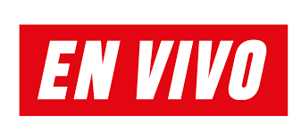
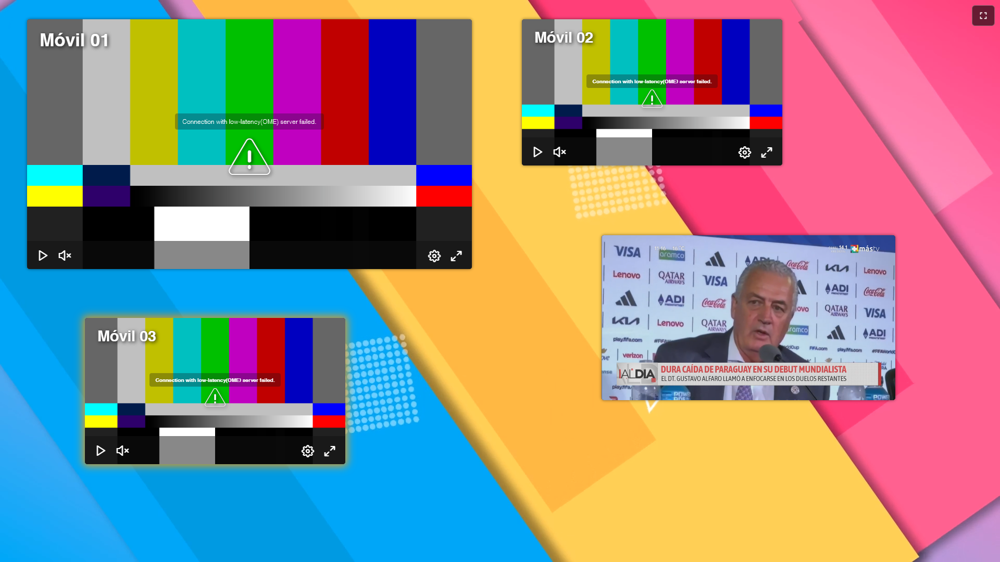
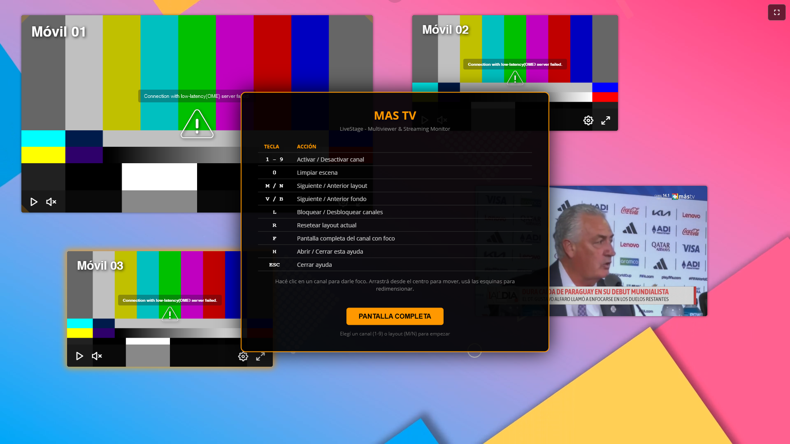

# LiveStage (MAS TV) - Multiviewer & Streaming Monitor



**LiveStage** es una potente plataforma web de monitoreo multiviewer diseñada para estaciones de televisión, productores de contenido y centros de operaciones de red (NOC). Permite la visualización simultánea de hasta 6 señales de video con ultra baja latencia, ofreciendo un control total sobre el diseño de pantalla y la interactividad.

---

## 🚀 Características Principales

- **Multiview Dinámico:** Más de 30 layouts predefinidos para diferentes necesidades de monitoreo (Solo, Splits, PiP, CCTV, Focus).
- **Baja Latencia:** Optimizado para **WebRTC** y **Low-Latency HLS (LL-HLS)** utilizando OvenPlayer y HLS.js.
- **Interfaz Interactiva:** Sistema de contenedores que permite arrastrar y redimensionar canales manteniendo siempre la relación de aspecto **16:9**.
- **Fondos Personalizables:** Soporte para fondos de video dinámicos y modos de transparencia para integración con overlays.
- **Control Total por Teclado:** Operación rápida sin necesidad de ratón para cambios de escena críticos.
- **Pantalla de Ayuda Integrada:** Al presionar `H` se muestra un overlay con todos los atajos de teclado y botón de pantalla completa.
- **Ligero y Versátil:** Desplegable en cualquier servidor web estándar o mediante Docker.

---

## 📸 Capturas de Pantalla

| Vista Principal | Pantalla de Ayuda |
| :---: | :---: |
|  |  |

---

## 🛠️ Instrucciones de Instalación

### Requisitos Previos
- Servidor Web (Nginx o Apache).
- PHP 7.4 o superior (necesario para el escaneo de fondos en `getbackground.php`).
- Conectividad con un servidor de streaming (ej. OvenMediaEngine).

### Instalación Manual
1. Clona este repositorio o descarga los archivos en tu directorio raíz:
   ```bash
   git clone https://github.com/walter8729/livestage.git
   ```
2. Asegúrate de que la carpeta `videobg/` tenga permisos de lectura.
3. Configura la IP de tu servidor de streaming en el archivo `js/app.js`:
   ```javascript
   const STREAM_SERVER_IP = 'tu.servidor.streaming';
   ```

### Uso con Docker (Recomendado)
Si tienes Docker instalado, puedes levantar el proyecto en segundos:
```bash
docker-compose up -d
```
El servicio estará disponible en `http://localhost:8080`.

---

## ⌨️ Ejemplos de Uso y Atajos

La aplicación está diseñada para ser operada principalmente mediante el teclado para garantizar rapidez en entornos de producción.

| Tecla | Acción |
| :--- | :--- |
| `1` - `6` | Activar/Desactivar (Toggle) un canal específico. |
| `0` | Limpiar escena (Remover todos los canales). |
| `M` | Siguiente Layout de TV (Navegar entre los 30+ diseños). |
| `N` | Layout de TV anterior. |
| `V` | Siguiente video de fondo (Background). |
| `B` | Video de fondo anterior. |
| `L` | Bloquear/Desbloquear movimiento y redimensionado de canales. |
| `R` | Resetear el layout actual a sus posiciones originales. |
| `F` | Pantalla completa del canal que tiene el foco. |
| `H` | Mostrar/ocultar la pantalla de ayuda con todos los atajos. |
| `ESC` | Cerrar ayuda o salir de pantalla completa. |

### Cómo redimensionar canales
1. Haz clic en un canal para darle foco.
2. Utiliza los manejadores en las esquinas para cambiar el tamaño.
3. Arrastra desde el centro para posicionar el canal donde desees.

---

## 📂 Estructura del Proyecto

- `index.html`: Aplicación principal (Multiviewer Interactivo).
- `js/app.js`: Lógica principal, definiciones de layouts y control de reproductores.
- `js/ovenplayer.js`: OvenPlayer v0.10.23 (librería local).
- `getbackground.php`: Script backend para listar dinámicamente los videos en la carpeta `videobg`.
- `css/estilos.css`: Estilos visuales y animaciones.
- `screenshots/`: Capturas de pantalla de la aplicación.

---

## ❓ Ayuda y Documentación

Para soporte adicional o consultas técnicas:
- **OvenPlayer:** [Documentación Oficial](https://airensoft.gitbook.io/ovenplayer/)
- **HLS.js:** [Repositio de GitHub](https://github.com/video-dev/hls.js/)
- **FAQ:** Revisa los logs de la consola del navegador (`F12`) para depurar problemas de conexión con los streams.

---

## 🤝 Contribuciones

¡Las contribuciones son bienvenidas! Si deseas mejorar los layouts o añadir nuevas funcionalidades:
1. Haz un **Fork** del proyecto.
2. Crea una rama para tu mejora (`git checkout -b feature/MejoraIncreible`).
3. Haz un **Commit** de tus cambios.
4. Envía un **Pull Request**.

---

## ⚖️ Licencia

Este proyecto está bajo la licencia **MIT** con cláusulas adicionales (ver [LICENSE](LICENSE)). Esto significa que puedes usarlo, modificarlo y distribuirlo libremente, incluso para fines comerciales, siempre que incluyas un enlace visible al repositorio original. Si realizas mejoras significativas, te solicitamos amablemente (sin ser obligatorio) que las compartas mediante un Pull Request para que toda la comunidad se beneficie.

---

## 📽️ Estado del Proyecto

**Estado:** `Desarrollo Activo / Beta`
El proyecto se encuentra en una fase de optimización de layouts y mejora de la estabilidad de las señales WebRTC.

> **Nota para IONOS:** Asegúrate de que el archivo `.htaccess` permita la ejecución de scripts PHP y el acceso a la carpeta de recursos.